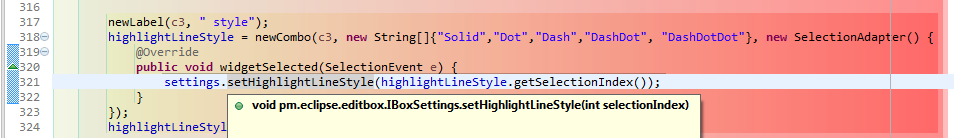
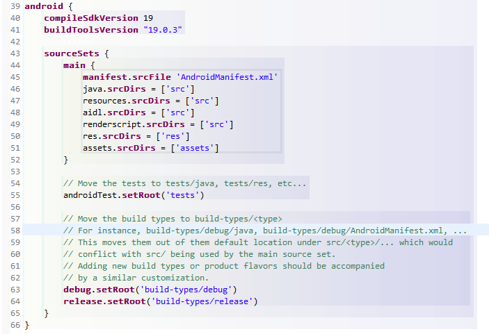
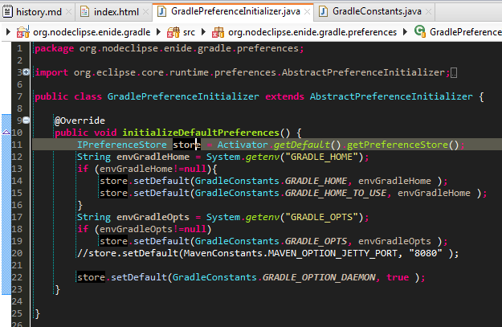
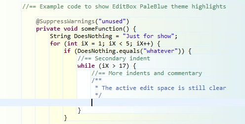

# EditBox Eclipse plugin


[](http://travis-ci.org/Nodeclipse/EditBox)
<a href="http://marketplace.eclipse.org/marketplace-client-intro?mpc_install=1582059" title="Drag and drop into a running Eclipse
 to install Nodeclipse EditBox"></a>
or use `http://www.nodeclipse.org/updates/`

EditBox is using background colors theme to highlight code blocks.

  

This is converted to git and mavenized EditBox Eclipse plugin [created by Piotr Metel](http://editbox.sourceforge.net/).
The author was working for project in 2009-2011. Latest version released by Piotr Metel was 0.0.22.
Named as 0.22 Alpha.

Paul Verest has discovered about EditBox though "Added EditBox support #52" <https://github.com/guari/eclipse-ui-theme/pull/52>.
And emailed the author. Whether author will answer or not, having project on GitHub hopefully will revive it.

UPDATE: In one day 2014-03-26 converted to git and mavenized; added RainbowDrops.es by @Vexatos;  
 on second day 2014-03-27 changed default theme list to include all themes, add major languages as category,
 make default configuration in [10 lines](https://github.com/Nodeclipse/EditBox/blob/master/pm.eclipse.editbox/src/pm/eclipse/editbox/impl/BoxProviderRegistry.java#L85-95),
 for example

	result.add(createProviderForNameAndExtentions("c++",	Arrays.asList("*.c", "*.cpp", "*.h", "*.hpp") ) ); 
	
For example [add Blue Light theme](https://github.com/Nodeclipse/EditBox/commit/b7ceed8f1c391b691f39ee7f45b5613651ab91ca)	
	
Latest released version is 0.60.0.	 

	mvn -Dtycho.mode=maven org.eclipse.tycho:tycho-versions-plugin:set-version -DnewVersion=0.65.0-SNAPSHOT

While it is nice to play with colors, there are Nodeclipse core projects to do.  
If there are updates here, they will be released together with [Nodeclipse train](http://www.nodeclipse.org/history).

### History

0.50
0.55
0.60
0.65 (2014-08) change icon; 
	Checkbox "Plugin enabled";
	combo to apply one of bundled themes to all categories	
	(this is done for case when switching to black themes and back)

## Themes

Text Category included `*.*` file mask. Remove it for better customization.

All themes are inside [pm.eclipse.editbox/src](https://github.com/Nodeclipse/EditBox/tree/master/pm.eclipse.editbox/src)

in `BoxProviderRegistry.java` "Default", "Whitebox", "RainbowDrops", "OnClick", "GreyGradient", "Java_v_20"

- Default is like on image above, differs for java, markup, python, text
- [Whitebox][2] - only border highlight for mouse-over
- [OnClick][3] - border highlight for mouse-over, and the current block highlight like Default when clicking inside
- GreyGradient
- Java_v_20 
- [RainbowDrops][4] - for black background themes, e.g. Moonrise, Black by Jeeeyul, Dark in Eclipse 4.4  


- [OrangeToRed][5]

- [BlueToDeepBlue][6]  

- [BlueGradient22WithDarkBoldLeftBorder][7]  

- [BlueLight][8]  

- [RainDropsLine][9]  

- [PaleBlue](10) by Robin Martin


  [2]: https://raw.githubusercontent.com/Nodeclipse/EditBox/master/pm.eclipse.editbox/src/Whitebox.eb
  [3]: https://raw.githubusercontent.com/Nodeclipse/EditBox/master/pm.eclipse.editbox/src/OnClick.eb
  [4]: https://raw.githubusercontent.com/Nodeclipse/EditBox/master/pm.eclipse.editbox/src/RainbowDrops.eb
  [5]: https://raw.githubusercontent.com/Nodeclipse/EditBox/master/pm.eclipse.editbox/src/OrangeToRed.eb
  [6]: https://raw.githubusercontent.com/Nodeclipse/EditBox/master/pm.eclipse.editbox/src/BlueToDeepBlue.eb
  [7]: https://raw.githubusercontent.com/Nodeclipse/EditBox/master/pm.eclipse.editbox/src/BlueGradient22WithDarkBoldLeftBorder.eb
  [8]: https://raw.githubusercontent.com/Nodeclipse/EditBox/master/pm.eclipse.editbox/src/BlueLight.eb
  [9]: https://raw.githubusercontent.com/Nodeclipse/EditBox/master/pm.eclipse.editbox/src/RainbowDropsLine.eb
  [10]: https://raw.githubusercontent.com/Nodeclipse/EditBox/master/pm.eclipse.editbox/src/PaleBlue.eb

Hints:
- Before modifying or importing a theme change name
- (for themes with gradient) Adjust "Alpha blending" to make theme lighter or darker.

Add your themes like [Blue & Red](https://github.com/Nodeclipse/EditBox/commit/6dea8079a3c77a91deaee8b35cd399a007971dff) commit.

## Development

Default themes for a Category are defined in `pm.eclipse.editbox\src\pm\eclipse\editbox\impl\BoxProviderRegistry.java`

In eclipse with PDE (e.g. Enide Studio)
open `plugin.xml` , click `Launch an Eclipse application`.

Preferences are saved to file
`<workspace>\.metadata\.plugins\org.eclipse.core.runtime\.settings\pm.eclipse.editbox.prefs`  
see `pm.eclipse.editbox\docs` for an example. 

### Terms

Looking at code and .prefs file

```
pm.eclipse.editbox.provider.java_Default=\#COMMENT\r\n\#Mon Jun 30 17\:24\:47 CST 2014\r\nHighlightOne\=false\r\nFillGradient\=false\r\nFillSelected\=true\r\nRoundBox\=true\r\nBorderColorType\=1\r\nName\=Default\r\nExpandBox\=false\r\nBorderDrawLine\=false\r\nFillOnMove\=true\r\nAlpha\=0\r\nHighlightWidth\=1\r\nBorderWidth\=1\r\nHighlightColor\=acb3b7\r\nBorderColor\=c0c0c0\r\nFillKeyModifier\=Alt\r\nHighlightColorType\=3\r\nFillGradientColor\=dadcc2\r\nBuilder\=Java\r\nHighlightDrawLine\=false\r\nFillSelectedColor\=ffffff\r\nBorderLineStyle\=2\r\nColors\=ffffff-c5d0ac-d9e3b7-e8ecd9\r\nHighlightLineStyle\=0\r\nNoBackground\=false\r\nCirculateLevelColors\=false\r\n
pm.eclipse.editbox.provider.java_RainbowDrops=\#COMMENT\r\n\#Wed Jul 09 17\:06\:50 CST 2014\r\nHighlightOne\=true\r\nFillGradient\=false\r\nFillSelected\=false\r\nRoundBox\=false\r\nBorderColorType\=0\r\nName\=RainbowDrops\r\nExpandBox\=false\r\nBorderDrawLine\=true\r\nFillOnMove\=false\r\nAlpha\=0\r\nHighlightWidth\=1\r\nBorderWidth\=1\r\nHighlightColor\=00ff00\r\nBorderColor\=00bbbb\r\nFillKeyModifier\=Alt\r\nHighlightColorType\=0\r\nFillGradientColor\=null\r\nBuilder\=Java\r\nHighlightDrawLine\=true\r\nFillSelectedColor\=202020\r\nBorderLineStyle\=1\r\nColors\=202020-null\r\nHighlightLineStyle\=0\r\nNoBackground\=false\r\nCirculateLevelColors\=false\r\n
pm.eclipse.editbox.provider.java_catalog=Default,Whitebox,OnClick,GreyGradient,Java_v_20,RainbowDropsLine,RainbowDropsLineFill,BlueToDeepBlue,OrangeToRed,BlueGradient22WithDarkBoldLeftBorder,BlueLight,Java_PaleBlue,RainbowDrops
pm.eclipse.editbox.provider.java_default=RainbowDrops
pm.eclipse.editbox.provider.java_enabled=true
pm.eclipse.editbox.provider.java_fileNames=*.java,*.class,*.gradle,*.groovy,*.scala
```


Theme `BoxSettingsImpl` is set of colors .
Provider is theme applied to some category. Provider is holding current theme (Settings object).
Provider `BoxProviderImpl` is associated with category String (aka Provider name).  
Catalog is list of Themes, that provider has.  


### Build

`mvn package` to make update site and zip archive.

### Convertion to git notes

Converted with `git svn clone -s http://svn.code.sf.net/p/editbox/code/ editbox3 --trunk=plugin`

<http://stackoverflow.com/questions/9211405/how-to-migrate-code-from-svn-to-git-without-losing-commits-history>

https://sourceforge.net/p/editbox/code/HEAD/tree/plugin/

svn checkout svn://svn.code.sf.net/p/editbox/code/ editbox-code

git svn clone -s svn://svn.code.sf.net/p/editbox/code/


https://sourceforge.net/p/editbox/code/HEAD/tree/

svn checkout http://svn.code.sf.net/p/editbox/code/ editbox-code

git svn clone -s http://svn.code.sf.net/p/editbox/code/
git svn clone -s http://svn.code.sf.net/p/editbox/code/ editbox3 --trunk=plugin
OK
